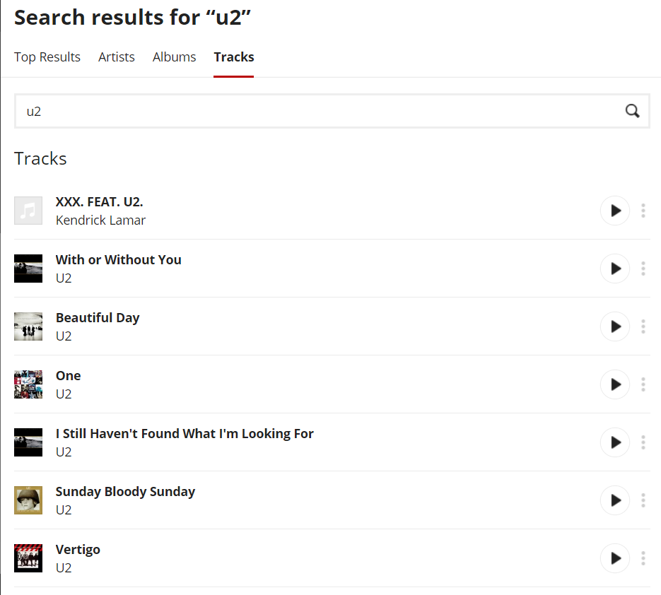

# Top Songs Dokumentation

## Inhaltsverzeichnis

* Zusammenfassung und Zielsetzung
* Dokumentation
* Teil 1: SPA mit API-Call
* Teil 2: React Native Umsetzung
* Fazit
* Weiteführendes

### Zusammenfassung und Zielsetzung
Im ersten Schritt möchte ich eine Webanwendung gestalten, die API Calls verwaltet. Im zweiten Schritt möchte ich mich mit der Umsetzung in React oder React Native beschäftigen.
	 
Ziel: Eine schlichte Web Single Page Application aufbauen, die die LastFM API anspricht. Diese Anwendung soll im zweiten Schritt auf eine hybride App übertragen werden. In der Dokumentation möchte ich auf Gemeinsamkeiten und Unterschiede der Ansätze eingehen.Zudem möchte ich den Zusammenhang zwischen React im Web und React Native verstehen um für kommende Projekte den richtigen Ansatz wählen zu können.

### Dokumentation
Aus Interesse an verschiedenen Dokumentationsmöglichkeiten, werde ich den wesentlichen Teil der Dokumentation in einer statischen MkDocs Website veröffentlichen.

### Teil 1: SPA mit API-Call

LAST.fm Musikdatenbank API:
· API ist frei verfügbar
· Nutzung mit einfacher user-key Authentifizierung sowie mit OAuth 2.0 möglich
    Funktionsumfang:
· Interpreten Suchfunktion
· Es sollen die bekanntesten Titel eines Musik Interpreten aufgelistet werden
Coding mit HTML und Javascript sowie grundlegende Gestaltung mit CSS

## Etwas genauer

Last.fm ist ein Musikportal, das Metadaten zu Künstlern und deren Musik archiviert und über Streaming bereitstellt. 
Last.fm verbindet sich den gängigen Musikstreaming Plattformen wie iMusic und Spotify, auf diese Art und Weise ist es nicht zwingend nötig, die Musik über den last.fm eigenen Player zu hören.
Last.fm sammelt und analysiert das Nutzungsverhalten seiner Plattform und stellt die gesammelten Informationen wiederum den Nutzer bereit. 
Auf der Basis des Hörverhaltens der Nutzer werden Profile erstellt und so entstehen verschiedenste Arten von Musikempfehlungensystemen. Das kollaborative Filtern spielt bei den Musikempfehlungen die grösste Rolle.

Arten von Musikempfehlungssystemen (Seminararbeit, Kapitel 3 Stichwort kollaboratives Filtern)

Last.fm bezeichnet das Sammeln der Informationen der Hörer als "Scrobbling".
Sobald eine gewisse Anzahl von Liedern gehört wurde, meldet sich last.fm mit der Liste der gehörten Lieder und sie können gescrobbelt werden.
Auf diese Art und Weise können bestimmte Lieder, die man nicht mochte aus seinem Profil ausschliessen.
Durch das Scrobbling wird das Internetradio auf den Hörergeschmack laufend angepasst.

Als last.fm Nutzer vermisse ich eine schnelle, aussagekräftige Übersicht der Lieder von Interpreten.
Last.fm bietet eine universelle Suchfunktion, die auf Interpreten, Alben oder Tracks beschränkt werden kann,
Jedoch ist die Darstellung der Ergebnisse immer eine Mischung von Interpreten. Darüber hinaus ist es nicht möglich auf einen Blick die relevante Kennzahlen der einzelnen Musiktitel darzustellen. In der Liste der Suchergebnisse werden lediglich, Titel, Interpret und falls verfügbar ein passendes Artwork dargestellt.

### Teil 2: React Native Umsetzung

Ziel: SPA aus Teil 2 auf React Native umgestalten
 
Funktionsumfang:
· lastFM API Call wie in der SPA
· App Menu mit react navigation aufbauen
· Login über Social Media: Suchanfragen im eigenen Profil abspeichern
· Suchanfragen in Datenbank speichern mit Google Firestore 
· Navigationsstruktur:
        § lastFM search:
            · API Call 1: Top Songs
            · API Call 2: Albums
            · API Call 3: Artist Metadata
        § Login
About (Impressum mit Link zur MkDocs Dokumentation)

