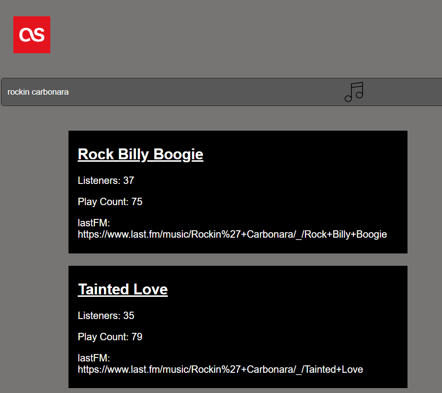
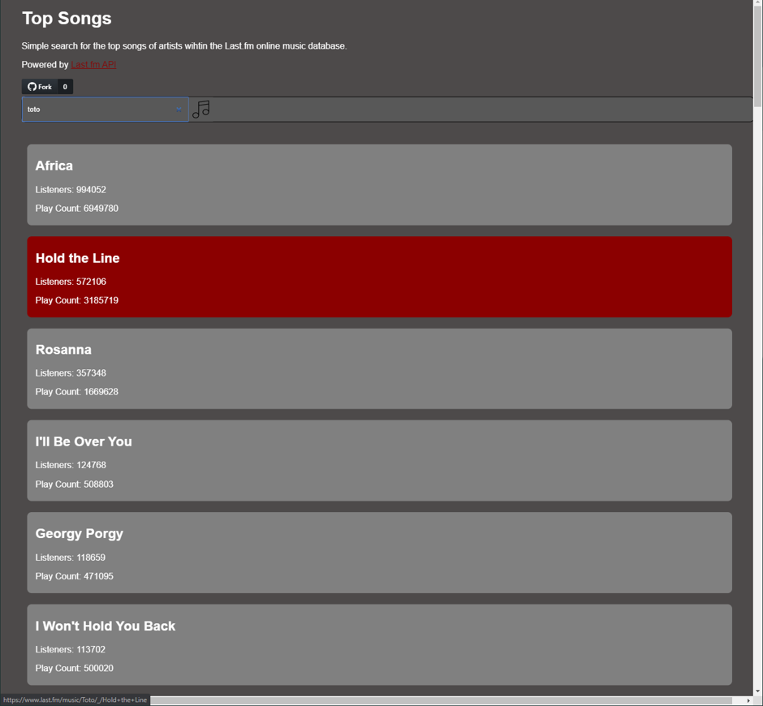
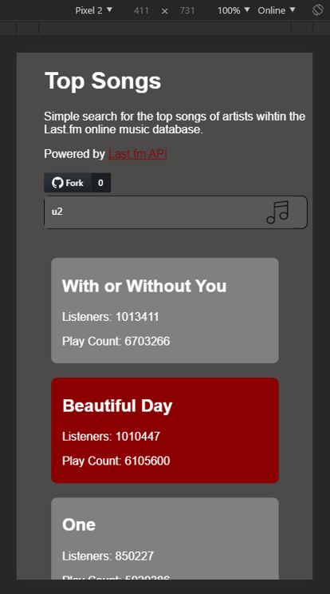

# Top Songs Dokumentation

## Inhaltsverzeichnis

* Zusammenfassung und Zielsetzung
* Dokumentation
* Teil 1: SPA mit API-Call
* Teil 2: React Native Umsetzung
* Fazit
* Weiteführendes

### Zusammenfassung und Zielsetzung
Im ersten Schritt möchte ich eine Webanwendung gestalten, die API Calls verwaltet. Im zweiten Schritt möchte ich mich mit der Umsetzung in React oder React Native beschäftigen.
	 
Ziel: Eine schlichte Web Single Page Application aufbauen, die die LastFM API anspricht. Diese Anwendung soll im zweiten Schritt auf eine hybride App übertragen werden. In der Dokumentation möchte ich auf Gemeinsamkeiten und Unterschiede der Ansätze eingehen.Zudem möchte ich den Zusammenhang zwischen React im Web und React Native verstehen um für kommende Projekte den richtigen Ansatz wählen zu können.

### Dokumentation
Aus Interesse an verschiedenen Dokumentationsmöglichkeiten, werde ich den wesentlichen Teil der Dokumentation in einer statischen MkDocs Website veröffentlichen.

## Teil 1: SPA mit API-Call

LAST.fm Musikdatenbank API:
· API ist frei verfügbar
· Nutzung mit einfacher user-key Authentifizierung sowie mit OAuth 2.0 möglich
    Funktionsumfang:
· Interpreten Suchfunktion
· Es sollen die bekanntesten Titel eines Musik Interpreten aufgelistet werden
Coding mit HTML und Javascript sowie grundlegende Gestaltung mit CSS

### Etwas genauer

Last.fm ist ein Musikportal, das Metadaten zu Künstlern und deren Musik archiviert und über Streaming bereitstellt. 
Last.fm verbindet sich den gängigen Musikstreaming Plattformen wie iMusic und Spotify, auf diese Art und Weise ist es nicht zwingend nötig, die Musik über den last.fm eigenen Player zu hören.
Last.fm sammelt und analysiert das Nutzungsverhalten seiner Plattform und stellt die gesammelten Informationen wiederum den Nutzer bereit. 
Auf der Basis des Hörverhaltens der Nutzer werden Profile erstellt und so entstehen verschiedenste Arten von Musikempfehlungensystemen. Das kollaborative Filtern spielt bei den Musikempfehlungen die grösste Rolle.

Arten von Musikempfehlungssystemen (Seminararbeit, Kapitel 3 Stichwort kollaboratives Filtern)

Last.fm bezeichnet das Sammeln der Informationen der Hörer als "Scrobbling".
Sobald eine gewisse Anzahl von Liedern gehört wurde, meldet sich last.fm mit der Liste der gehörten Lieder und sie können gescrobbelt werden.
Auf diese Art und Weise können bestimmte Lieder, die man nicht mochte aus seinem Profil ausschliessen.
Durch das Scrobbling wird das Internetradio auf den Hörergeschmack laufend angepasst.

Als last.fm Nutzer vermisse ich eine schnelle, aussagekräftige Übersicht der Lieder von Interpreten.
Last.fm bietet eine universelle Suchfunktion, die auf Interpreten, Alben oder Tracks beschränkt werden kann,
Jedoch ist die Darstellung der Ergebnisse immer eine Mischung von Interpreten. Darüber hinaus ist es nicht möglich auf einen Blick die relevante Kennzahlen der einzelnen Musiktitel darzustellen. In der Liste der Suchergebnisse werden lediglich, Titel, Interpret und falls verfügbar ein passendes Artwork dargestellt.

Mit meiner Anwendung, möchte ich die Datenbank von Last.fm durchsuchen und Suchergebnisse für meine Ansprüche übersichtlich darstellen.
Relevante Informationen, die ich über die last.fm API beziehen möchte:
	- Track Titel
	- Anzahl der Hörer auf last.fm
	- Wie oft das Lied gespielt wurde über last.fm oder verknüpfte Anwendungen ("play count")

Meine App beschränkt sich auf die Darstellung dieser Informationen. 
Die App soll über die Eingabe eines Interpreten eine Übersicht der Musiktitel geordnet nach der Beliebtheit der Titel.
Die Beliebtheit soll sich auf die Anzahl der Hörer auf Last.fm beziehen. 
	

### Deployment auf Heroku

Ich bin zum Entschluss gekommen, den ersten Teil 1 meines Projekts auf Heroku zu deployen.

https://topsongs-lastfm.herokuapp.com/

## Teil 2: React Native Umsetzung

Ziel: SPA aus Teil 2 auf React Native umgestalten
 
-	Nutzung der Last.fm API
-	Charts verschiedener Länder sollen aktuell abgefragt und dargestellt werden
-	React Native Framework kennen lernen
-	Geplante Komponenten:
-   React Navigation – um eine Navigation in der App zu realisieren
-   Expo 
        - Schnelles ausprobieren der App während des Entwicklungsprozesses
        - Möglichkeit zur Entwicklung mit expo.snack

##	Entwurf
Eine SPA besteht aus einem einzigen Hyper Text Markup Language (HTML) -Dokument, das Benutzerinhalte dynamisch nachladen kann. Die Idee hinter der SPA ist es, die Rechenleistung der immer stärkeren Anwendergeräte, so weit wie möglich auszunutzen. Klassische Webanwendungen bestehen meist aus mehreren untereinander verlinkten HTML-Dokumenten. Wird eine neue, möglicherweise über einen Link verknüpfte, Website aufgerufen, wird die gesamte Präsentation der aktuellen Website abgebrochen, verworfen und das Laden der neuen Seite beginnt. Durch dynamisches, asynchrones Nachladen von Daten wird die Serverlast reduziert und Wartezeiten können kürzer ausfallen. Ein Laden von Daten via HTTP über das Internet ist in den meisten Fällen langsamer, als das lokale Laden von Daten aus einem Cache. 
Der Entwurf sieht eine SPA vor, die sich dynamisch an die Fenstergröße des Anwenders anpasst.
Mit den Chrome Browser Entwicklertools soll sichergestellt werden, dass die Anwendung auch aktuellen Smartphones (iPhone X, Google Pixel 2) sauber dargestellt wird.
Das Resultat der Suche nach einem Interpreten soll eine übersichtliche Liste mit den meist gehörten Titeln ergeben. Die Titel sollen sich nach von oben nach unten fortsetzen, womit ein Scroll-Leiste nötig sein wird. Die farbliche Gestaltung soll klar sein, die Schrift sich deutlich vom Hintergrund abheben. Eine dunkle Gestaltung der Website wird bevorzugt.
React Native baut auf der Open-Source JavaScript Software-Bibliothek React auf. React stellt ein Grundgerüst an Komponenten zu Verfügung, die das Programmieren vereinfachen und vereinheitlichen. React Native ist eine React Software-Bibliothek die es ermöglicht native mobile Anwendungen und Webanwendungen mit der gleichen Codebasis zu erstellen. 
Die React Native app soll die Charts der Länder Schweiz und Deutschland ein einer ähnlichen Übersicht zeigen. Der Wechsel zwischen den Charts der beiden Länder soll mit Elementen von React Navigation umgesetzt werden. Die Farbgebung soll sich genauso wie die SPA dunkel halten.
Für die Dokumentation der Anwendungen wird die Auszeichnungssprache Markdown verwendet. In Online Versionsverwaltungsplattformen wie Github und Gitlab wird Markdown oft verwendet um eine Übersicht über das Repositorium zu geben. Für dieses Projekt wird der statische Dokumentationsgenerator MkDocs. MkDocs setzt vollständig auf Markdown und bietet Templates für die Navigaton durch die Dokumentation, ähnlich einem Inhaltsverzeichnis einer word- oder pdf-Datei.

